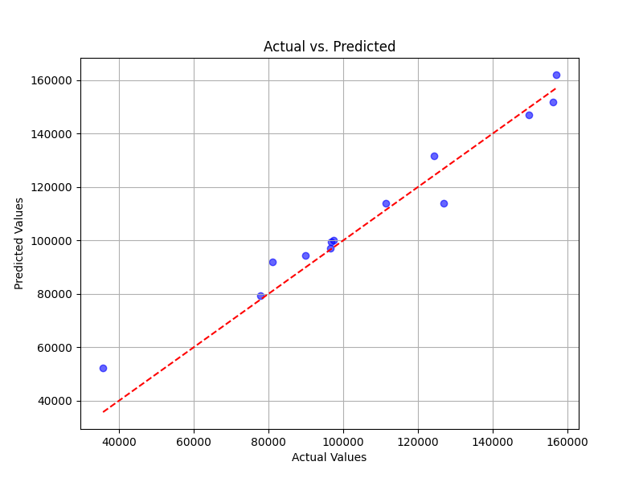

# 🚀 Startup Profit Prediction

This project uses machine learning models to predict the **profit of a startup** based on R&D Spend, Administration cost, and Marketing Spend.  
It leverages both **Linear Regression** and **Random Forest Regressor**, achieving high accuracy and great visual insights.

---

## 📊 Model Performance

| Model                   | R² Score |
|-------------------------|----------|
| Linear Regression       | 96.68%   |
| Random Forest Regressor | 95.08%   |

---

## 📸 Actual vs Predicted Plot




---

## ⚙️ Technologies Used

- Python
- Jupyter Notebook
- pandas, NumPy
- scikit-learn
- matplotlib, seaborn

---

## ▶️ How to Run

1. Clone the repo:
   ```bash
   git clone https://github.com/your-username/startupprediction.git
   cd startupprediction
